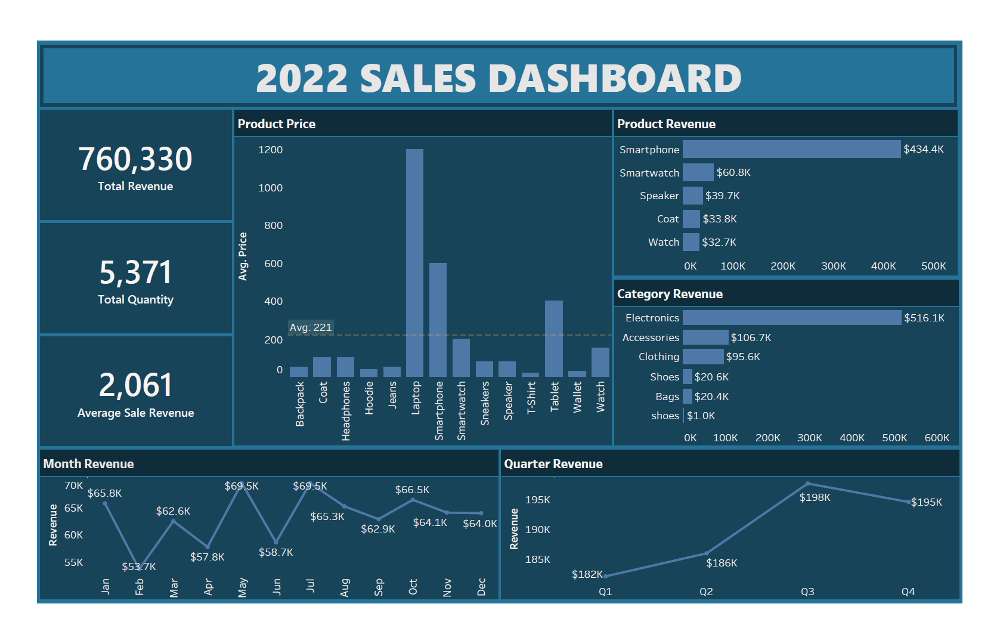

# Small Sales Analysis

## Overview
The objective of this project is to analyze sales data to gain insights into product performance and revenue generation. The analysis focuses on understanding sales trends, identifying top-performing products, and optimizing inventory management. 

## Dataset Overview
The dataset includes sales data for various products across different categories, capturing key metrics like price, quantity sold, and revenue generated. It includes columns like:
- **Date**: The date of the sale.
- **Product**: The name of the product sold.
- **Category**: The category to which the product belongs.
- **Price**: The price of the product.
- **Quantity**: The number of units sold.
- **Revenue**: The total revenue generated from the sale.

## Data Cleaning and Analysis
The data analysis and cleaning process was conducted using SQL to ensure data integrity and accuracy. This included:
- Removing duplicates.
- Handling missing values.
- Correcting inconsistencies in the dataset.
- Exploratory Data Analysis.

## Dashboard
A dashboard was created using Tableau to visualize the sales data, showcasing key insights and trends. Below is a preview of the dashboard:

## Tools
- **SQL** for data analysis and cleaning.
- **Tableau** for dashboard creation.
